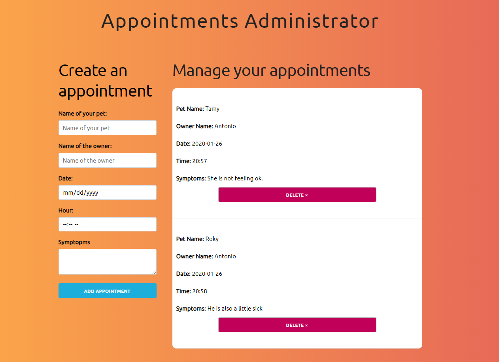
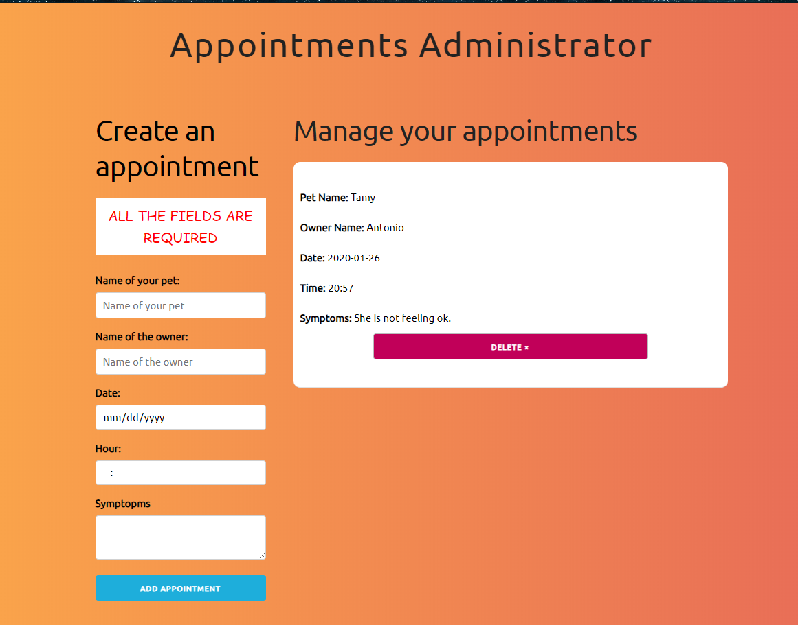

REACT APPOINTMENTS

I created this project to improve my React skills.

Deployed in Netlify: https://awesome-noyce-8c3f2a.netlify.com/

This is a very basic project where you can add appointments by filling a form.

How it looks like:

After adding an appointment:

If a user tries to submit an appointment with empty fields he will see an alert:
(Used conditional rendering for this one)

It was a quick project that's why I dindnt pay much attention to the styles.
